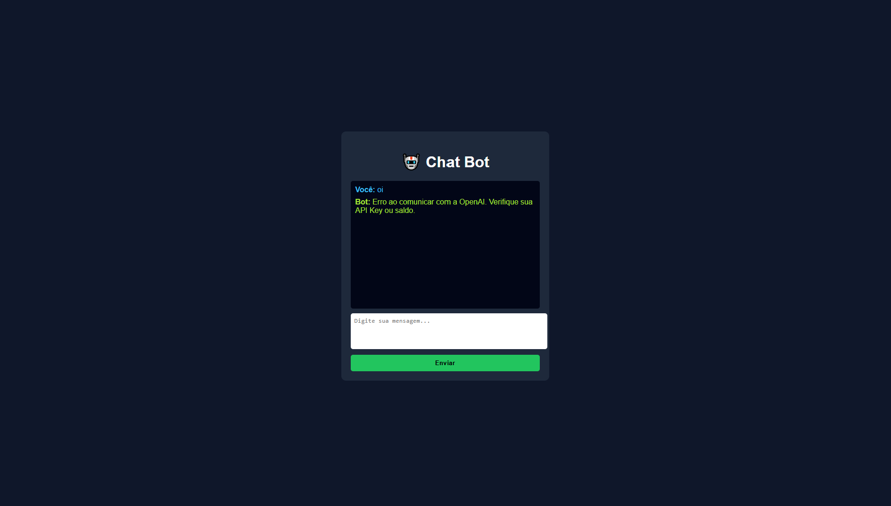
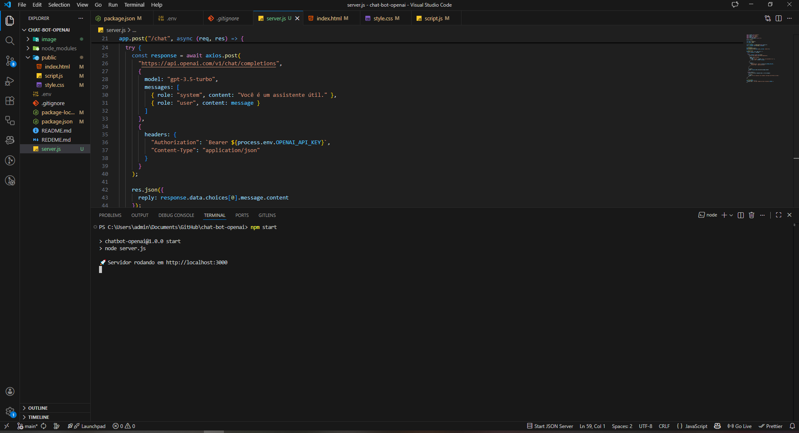

# 🤖 Chat Bot – Projeto em Node.js

Este projeto é uma aplicação simples de **Chat Bot** desenvolvida em **Node.js**, com uma interface **frontend básica e elegante** e um **backend** responsável por processar as mensagens.

O objetivo principal do projeto é demonstrar:
- Estrutura de um projeto em Node.js
- Comunicação entre frontend e backend
- Manipulação de requisições HTTP
- Tratamento de erros e uso de respostas simuladas

---

## 📁 Estrutura do Projeto

chat-bot-openai/
│
├─ image/
│   ├─ Front.png
│   └─ terminal.png
│
├─ public/
├─ index.js
├─ package.json
└─ README.md

---

## 🖼️ Demonstração do Projeto

### Interface Web (Frontend)
Abaixo está a interface gráfica do Chat Bot, desenvolvida em HTML, CSS e JavaScript:



### Execução no Terminal
A imagem abaixo mostra o servidor rodando corretamente no terminal:




## 🚀 Tecnologias Utilizadas

- **Node.js**
- **Express.js**
- **HTML5**
- **CSS3**
- **JavaScript (Vanilla)**

---

## ▶️ Como Rodar o Projeto

1. Instale as dependências:
```bash
npm install
Inicie o servidor:

npm start
Acesse no navegador:

http://localhost:3000
🖥️ Funcionamento da Aplicação
O usuário digita uma mensagem no frontend.

A mensagem é enviada para o backend via requisição HTTP.

O backend processa a mensagem.

Uma resposta é retornada e exibida na tela.

Toda a aplicação roda localmente (localhost).

⚠️ Por que este projeto NÃO utiliza a API da OpenAI diretamente?
Inicialmente, o projeto foi planejado para utilizar a API da OpenAI.
Durante os testes, a API retornou o erro:

insufficient_quota
Esse erro indica que o limite de uso (quota) da API foi excedido.

Foi implementada uma resposta simulada no backend, substituindo temporariamente a resposta real da OpenAI.

Essa solução permite:

Demonstrar toda a lógica de comunicação frontend ↔ backend

Tratar erros de forma adequada

Evitar dependência de serviços pagos

Garantir estabilidade durante a avaliação

A integração com a OpenAI pode ser facilmente adicionada futuramente.

✅ Conclusão
Este projeto cumpre seu objetivo educacional ao demonstrar:

Criação de um backend em Node.js

Integração com frontend

Tratamento de erros reais

Tomada de decisão técnica diante de limitações externas

👨‍💻 Projeto desenvolvido por Vitor Melo
